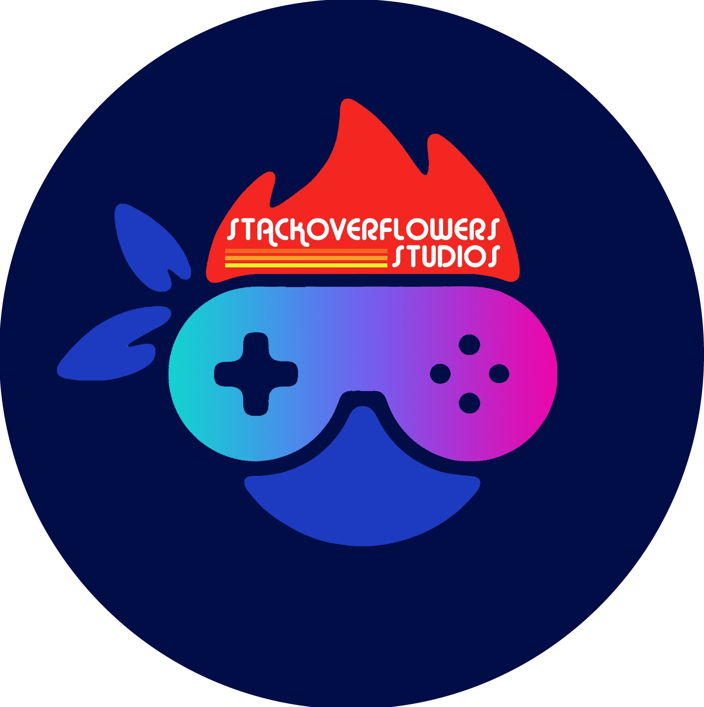

<h1>Welcome to My Backlog Handler&trade; from StackOverflowers Studios&copy;</h1>

  
Activating Virtual Enviroments

  <ul>
	<li>For users to properly install dependencies for this application, a Virtual Enviroment is needed so all packages can be used properly</li>
  <li>
    For Windows 10 users:
    <ol>
      <li>Enter in the Command Prompt: <code>python -m venv venv/</code></li>
      <li>To activate Virtual Enviroment, type in the Command Prompt:  <code>venv\Scripts\activate</code></li>
      <li>To install project dependecies, type in the Command Prompt: <code> pip install -r requirements.txt</code></li>
      <li>To deactivate Virtual Enviroment, type in the Command Prompt: <code>deactivate</code></li>
    </ol>
  </li>
  
  <li>
    For macOS & Linux users:
    <ol>
      <li>Enter in the Terminal: <code>python -m venv venv/</code></li>
      <li>To activate Virtual Enviroment, type in the Terminal:  <code>source venv/bin/activate</code></li>
      <li>To install project dependecies, type in the Terminal: <code> pip install -r requirements.txt</code></li>
      <li>To deactivate Virtual Enviroment, type in the Terminal : <code>deactivate</code></li>
    </ol>
  </li>
 </ul>
  

	
Run Django Application on localhost

	<ul>
		<li>This application is hosted live using the <code>master</code> branch on Heroku via <a href="https://mybackloghandler.com">My Backlog handler</a></li>
		<li>In the case that developers need to run this application locally to test out new features, they can do so by typing in the terminal (while being in the 		project's root directory) the following command: <code> python3 manage.py runserver</code></li>
	</ul>

	
Add new models

	<ul>
		<li>For developers to use and create new models, all they need to do is to enter <code>index/models.py</code> and follow the similar structure that most 			Django data models follow, in this project there are severa created already</li>
		<li>After a new model has been created, they need to create a ViewSet and a Serializer in the <code>views.py</code> and the <code>serializers.py</code> 			inside the index folder. Inside the files there are several examples that they can use</li>
	</ul>

	
Migrating Data Models to Database

	<ul>
		<li>This application is using PostgreSQL as it's database, but these commands work for any DB that is registered on the <code>settings.py</code> file</li>
		<li>In the case that developers need to make data model migrations so that they can store data according to their needs, they need to run the following 2 			commands: 
			<ol>
				<li><code>python3 manage.py makemigrations</code></li> 
				<li><code>python3 manage.py migrate --database="myDBName"</code></li>
			</ol>
		</li>
	</ul>

	
Extract Games from IGDB API

	<ul>
		<li>This application uses the IGDB Game API to extract game information to store it in our database</li>
		<li>In the case that developers need to use this API they can do so by running the <code>request.py</code> file located in the root directory</li>
		<li>Developers can change the endpoint queries that IGDB uses to whatever they want, for more information on this check out the official
			<a href="https://api-docs.igdb.com/#about">IGDB API</a> documentation</li>
		<li>Once the developer runs the file, a JSON file containing the parsed information from the API's query request should be generated in the 						<code>res</code> folder called <code>data.json</code></li>
	</ul>

	
Upload Parsed Game information from IGDB API to Database

	<ul>
		<li>If developers want to upload parsed information from the API to the database, they can do so by running the following command:</li>
		<ul><li><code>python3 manage.py runscript load_games</code></li></ul>
	</ul>

  
Meet the Team!

  <ul>
    <li><a href="https://github.com/bermed28">Fernando J. Bermúdez Medina</a> (Lead Back-End) </li>
    <li><a href="https://github.com/Chris36021">Christopher Castillo Carrero</a> (Lead Front-End) </li>
    <li><a href="https://github.com/Kevin-Lugo">Kevin J. Lugo Rosado</a> (Lead Full Stack) </li>
    <li><a href="https://github.com/gabrieldiazmorro">Gabriel Y. Diaz Morro</a> (Associate Back-End) </li>
    <li><a href="https://github.com/angel-vazquez25">Angel K. Vazquez Sanchez</a> (Associate Full Stack)</li>
  </ul>

<h3>StackOverflowers Studios&copy;, all rights reserved</h3>
<h3>Cloning, Contribution or Duplication of this repository is PROHIBITED unless authorized by the developers</h3>

